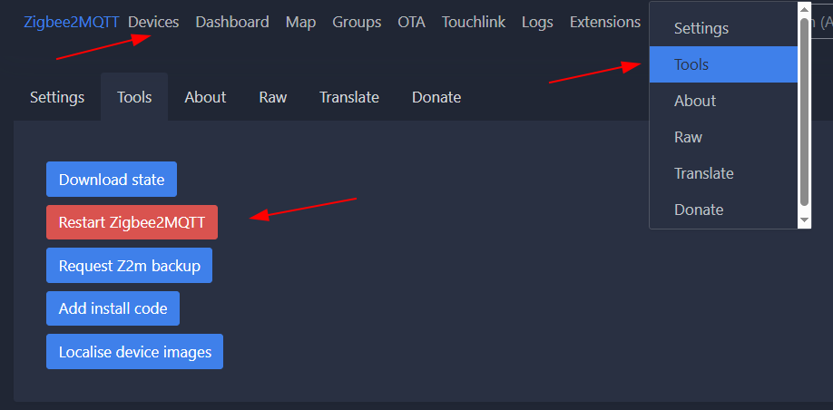

## Zigbee2MQTT and the XIAO MG24

### We need to...

* Create Zigbee NCP for use with Zigbee2MQTT

* Config file setup (configuration.yaml)

* Add External Converters (for our devices)


##### Step 1

Flash the Zigbee NCP firmware to the XIAO MG24
See this [link](https://github.com/grobasoz/xiao_mg24/blob/main/firmware/ZIGBEE_NCP/Readme.md)

Note the serial port assigned to the XIAO MG24 NCP device

##### Step 2

[Install Zigbee2MQTT](https://www.zigbee2mqtt.io/guide/installation/05_windows.html) and setup accordingly. 
*NB. Install an MQTT broker if you don't have one already*


##### Step 3

Edit the *configuration.yaml* file

```cd data
copy configuration.example.yaml configuration.yaml
edit configuration.yaml (i.e. with your usual editor)
```

Add the following basic settings (modifying where necessary)
``` mqtt:
  base_topic: zigbee2mqtt
  server: mqtt://127.0.0.1:1883
  user: *username*
  password: *password*
serial:
  port: *COMxx*
  adapter: ember
  rtscts: false
  baud: 115200
```

### External Converters

External Converters are used to interpret messages for transport to and from your Zigbee device

Some "external converters" have been added to this repository, see [external_converters](https://github.com/grobasoz/xiao_mg24/tree/main/Zigbee2MQTT/external_converters) folder

With latest Zigbee2MQTT these are loaded automatically if they are placed in the *external_converters* folder and follow the prescribed format ([see here](https://www.zigbee2mqtt.io/advanced/more/external_converters.html))

For a device with an unknown Zigbee Model (ie *zigbeeModel*), an external converter can be generated from the device that has joined the network

Once Zigbee2MQTT is up and running, connect to the "backend" web page on your PC at http://127.0.0.1:8099/#/

Select your device from the Devices tab and select the *Dev Console* tab.

Click "generate_external_definition" and save the text to a javascript file (eg *xiao_light_converter.js*)

Once added, restart Zigbee2MQTT from the console or by selecting the *Settings* dropdown,  (top right of menu), select *Tools* from the drop down and then click the *Restart Zigbee2MQTT* button




## Troubleshooting Converters

External Converters are quite tricky and can cause issues when parsing data received by Zigbee2MQTT from devices

When Zigbee2MQTT starts, check the external converter loads OK, then when data arrives watch the console for error messages

Check on well known implementations for ideas on how to correctly add conversions, reporting and bindings

The [*xiao_mg24_swt.js*](https://github.com/grobasoz/xiao_mg24/blob/main/Zigbee2MQTT/external_converters/xiao_mg24_swt.js) has some details on these features