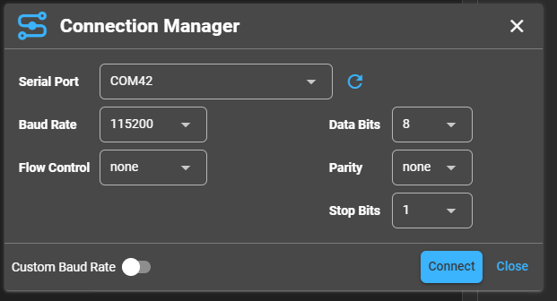
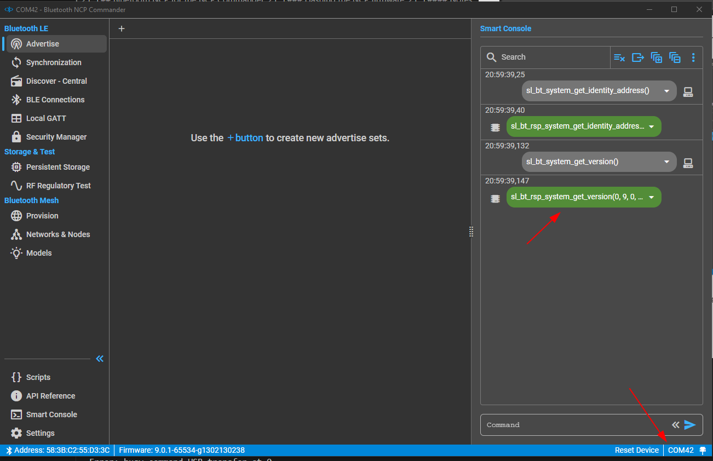

## Bluetooth NCP for the NCP Commander

### Flashing the NCP firmware

#### Bootloader

* XIAO_MG24_BGAPI_DFU.hex

#### BLE NCP Firmware

* XIAO_MG24_BLE_NCP.hex


##### XIAO MG24 BLE NCP Test with NCP Commander
NB: Make sure only one USB based XIAO MG24 is connected

**Flash the bootloader - from the OpenOCD folder**
```flash_code ..\firmware\BLE_NCP\XIAO_MG24_BGAPI_DFU.hex```

(Should take less than 1 second)

**Flash the main application**
```flash_code ..\firmware\BLE_NCP\XIAO_MG24_BLE_NCP.hex```

(Should take about 10 seconds)

<hr>

#### Using Silabs Bluetooth NCP Commander

[NCP Commander Usage and Help](https://docs.silabs.com/simplicity-studio-5-users-guide/latest/ss-5-users-guide-tools-bluetooth-ncp-commander/).

*Download Link (TBA).*

Currently Simplicity Studio needs to be installed and NCP Commander run from the *Tools > Bluetooth NCP Commander Standalone* command.

#### Notes:

When first started, the serial port of the XIOA MG24 that is programmed with the BLE NCP firmware can be selected.



Click connect and the following should appear...


The green responses are from the NCP device.

Select the Discover menu to allow scanning.


#### Troubleshooting.

1.  Ensure the correct firmware has been flashed to the correct device. the *verify_code.bat* file can also be used to check the flash has been programmed correctly.

2. After the NCP has been programmed, with a serial port terminal program set to decode hex, check the correct data is received. You will need to activate the **DTS** signal.

The following (or close to) should be received.
> 0xA0, 0x12, 0x01, 0x00, 0x09, 0x00, 0x00, 0x00, 0x01, 0x00, 0xFE, 0xFF, 0x01, 0x00, 0x00, 0x03, 0x01, 0x01, 0x3E, 0xEE, 0x9C, 0x4D