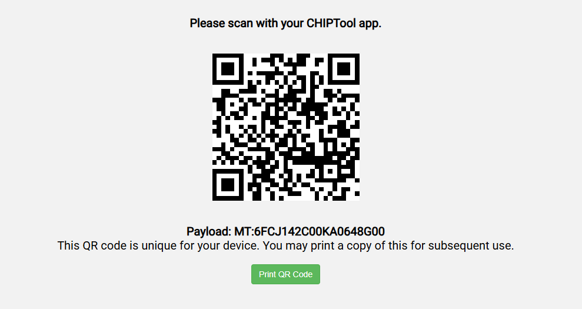

## Matter and the XIAO MG24

### Firmware

#### XIAO MG24 Matter Light over Thread - Arduino version

* XIAO_MG24_MLOT_Arduino.hex

##### with bootloader
* XIAO_MG24_MLOT_Arduino_BTL.hex

#### QR Code 

### Setup

Using your Matter Application (eg Apple's Home or Eve on a HomePod), Add a device and when the camera opens, scan the QR Code for the device you are installing.

Since this is a development platform, the device isn't certified but "Add Anyway", add it to a "Room" and test it works.