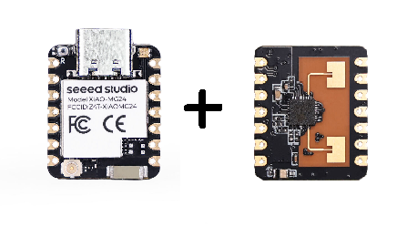

## XIAO MG24 Zigbee Firmware

#### Bootloaders
* XIAO_MG24_BTL_STD.hex  - Standalone bootloader for MG24 (used for XModem upload via serial port).
* XIAO_MG24_BTL_INT_1K5.hex  - Internal bootloader for MG24 (used for OTA).

##### Test Firmware for XIAO_MG24 (Chip Antenna, No Sense)
* XIAO_MG24_ZBMIN_TEST.hex - Minimal Zigbee Application for testing - .axf for debugging.

* XIAO_MG24_LD2410_TEST.hex - Minimal Zigbee Application for LD2410 sensor testing.

<hr>

#### Example hardware

Pair a [XIAO MG24](https://www.seeedstudio.com/Seeed-Studio-XIAO-MG24-p-6247.html) with a [24GHz mmWave for XIAO](https://www.seeedstudio.com/Seeed-Studio-XIAO-24Ghz-mmwave-Human-Static-Presence-Module-p-6266.html).



#### Example command line entries


##### XIAO MG24 LD2410 Microwave Sensor Test.
NB: Make sure only one USB based XIAO MG24 is connected

**Flash the bootloader - from the OpenOCD folder**
> flash_code ..\firmware\SOC\XIAO_MG24_BTL_INT_1K5.hex

(Should take less than 1 second)

**Flash the main application**
> flash_code ..\firmware\SOC\XIAO_MG24_LD2410_TEST.hex

(Should take a 10 seconds)

If you have a serial port monitor connected to your XIAO MG24 you should see the following...

```c
Reset info: 0x06 ( SW)
SL_STATUS_NETWORK_UP 0x4043
NWK Steering stack status 0x15
Extended Reset info: 0x0600 (UNK)
LD2410 Init
LD2410 Starting
XIAO_MG24_LD2410> 

```

#### Connecting to Zigbee2MQTT

The device will try to connect to a Zigbee network automatically, eg Home Assistant via ZHA or Zigbee2MQTT.

##### To test with Zigbee2MQTT
Flash a second XIAO_MG24 with the bootloader firmware...
> flash_code ..\firmware\SOC\XIAO_MG24_BTL_STD.hex firmware 

and the NCP Application firmware. 

> flash_code ..\firmware\ZIGBEE_NCP\XIAO_MG24_NCP_SW_115k2.hex

Again, only one XIAO MG24 should be connected at a time.

<hr>

##### Multiple XIAO MG24's connected.
To use multiple XIAO MG24, modify the *adapter serial* number in the *cmsis-dap.cfg* file accordingly.
The serial number of the connected device can be found using the *ident_device* batch file line...
> Info : CMSIS-DAP: Serial# = 6E915816

Create a separate (numbered) *cmsis-dap.cfg* for each XIAO MG24 and call from the batch files accordingly.
eg. 
> cmsis-dap_6E915816.cfg

and modify this line accordingly in the flash_code.bat file...

> -f interface\cmsis-dap.cfg ^

to

> -f interface\cmsis-dap_6E915816.cfg ^
or
> -f interface\cmsis-dap_%1.cfg ^

and pass the serial number in the command as a parameter.

There are most likely better methods but I found this the easiest.