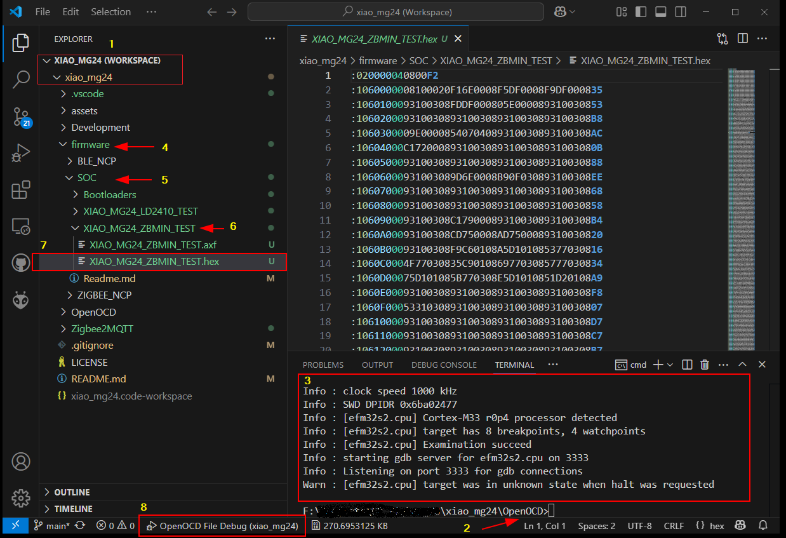

## XIAO MG24 Zigbee Firmware

#### Bootloaders
* See Bootloaders folder

#### Test Firmware for XIAO_MG24 (Chip Antenna, No Sense)
* See appropriate folder

### Windows Batch Commands

* ident-device (Identify the device)
 
* flash_code "firmware\\<flash_file>.hex"
 
* verify_code "firmware\\<flash_file>.hex"
 
* reset_run

* recover_erase (Warning! All code will be erased!)

* debug (then run gdb, or debug from within VSCode)


### Debugging (using VSCode and gdb)
1. Load the code as per normal, verify
2. Launch the gdb server - debug.bat
3. Select the hex file to debug (if axf file exists) - eg XIAO_MG24_ZBMIN_TEST.hex
4. Launch the debugger - OpenOCD File Debug

*NB. To make the launch easier, create a folder with the same name as the hex/axf file name - see XIAO_MG24_ZBMIN_TEST*
<hr>

#### Sample Debugging Session



1. Select the repository for a workspace in VSCode
2. Open a terminal and *cd OpenOCD*
3. Run *debug.bat*
4. Select *firmware* folder
5. Select *SOC* folder
6. Select *XIAO_MG24_MIN_TEST* folder
7. Select *XIAO_MG24_MIN_TEST.hex* file
8. Debug using the *OpenOCD File Debug* option


<hr>

#### Connecting to Zigbee Coordinator (eg Zigbee2MQTT)

The device will try to connect to a Zigbee network automatically, eg Home Assistant via ZHA or Zigbee2MQTT.

##### To test with Zigbee2MQTT
Flash a second XIAO_MG24 with the bootloader firmware...
```flash_code ..\firmware\SOC\XIAO_MG24_BTL_STD.hex firmware```

and the NCP Application firmware. 

```flash_code ..\firmware\ZIGBEE_NCP\XIAO_MG24_NCP_SW_115k2.hex```

Again, only one XIAO MG24 should be connected at a time.

<hr>

##### Multiple XIAO MG24's connected.
To use multiple XIAO MG24, modify the *adapter serial* number in the *cmsis-dap.cfg* file accordingly.
The serial number of the connected device can be found using the *ident_device* batch file line...
> Info : CMSIS-DAP: Serial# = 6E915816

Create a separate (numbered) *cmsis-dap.cfg* for each XIAO MG24 and call from the batch files accordingly.
eg. 
```cmsis-dap_6E915816.cfg ^```

and modify this line accordingly in the flash_code.bat file...

```-f interface\cmsis-dap.cfg ^```

to

```-f interface\cmsis-dap_6E915816.cfg ^```
or
```-f interface\cmsis-dap_%1.cfg ^```

and pass the serial number in the command as a parameter.

There are most likely better methods but I found this the easiest.